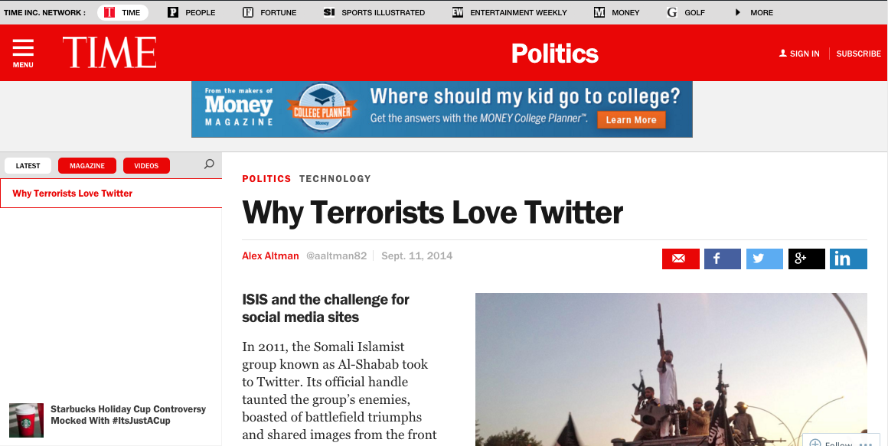
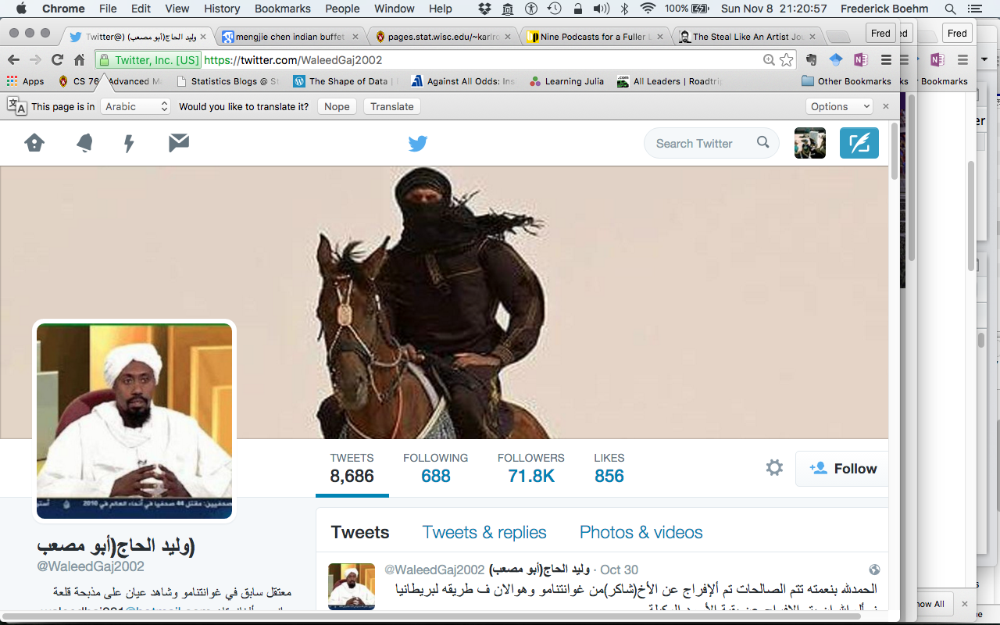

## Background & Motivation

- Terrorists have used twitter to communicate about and during attacks
    - Al-Shabab & Nairobi shopping mall in 2013

## Goals

- Terrorist sympathizers are a 'hard-to-reach' population
- Can we adapt respondent-driven sampling to this setting?
- What are useful network parameters that we'd like to estimate?

## Tools for accessing Twitter data

- Twitter has several APIs (Application program interface)
    - Streaming API gives access to a small percentage of tweets as they are being sent
    - Static API gives access to user-specific information
- Other researchers have written R packages to interface with Twitter's APIs    
    - `streamR`, `twitteR` and `smappR`

## Twitter data & terminology

- We refer to users that follow user A as "A's followers"
- Users whom user A follows are "A's friends"
- We can access the list of friends and list of followers for most users via the SMAPPR functions `getFriends` and `getFollowers`

## Twitter data vs. Traditional RDS

- Twitter permits us to see the entirety of a given user's friends & followers
- In RDS, we typically learn how many acquaintances a given person has and we get to see the identities of a limited number of them
- How can we leverage the added information (entire lists of friends & followers) that twitter gives us?

## Jaccard index

- Science indicates that a measure of overlap between sympathizers of distinct terrorist networks may be useful
- Jaccard index is defined, for a pair of sets, A and B, as the ratio of the cardinality of the intersection to the cardinality of the union

## Initial hub identification

- Via a google search, we found a list of terrorists on twitter
- One such user, \@WaleedGaj2002, has ~ 71,000 followers & 688 friends
    - former Guantanamo Bay prison detainee
    - Al Qaeda member

## Initial strategy to characterize the 'local' network around \@WaleedGaj2002

- Collect the list of friends of \@WaleedGaj2002
- 
- Randomly sample 2 friends, A and B
- Collect the list of friends of A and B
- Calculate the Jaccard index for (friends of A) and (friends of B)
- Repeat for another random sample of two friends

## Initial results

- To enter Monday morning

## Limitations

- Many tweets are in Arabic
    - Google translate is not always reliable
- Twitter actively disables accounts of terrorists
    - criteria for disabling are not clear

## Next steps

- Identify a hub from another terrorist organization 
    - ISIS
    - Boko Haram
    - Al-Shabab

## References

